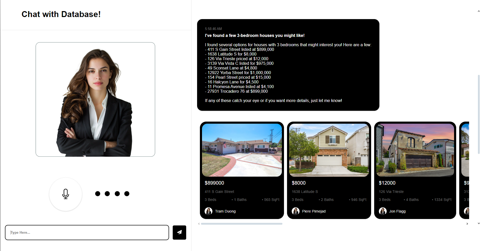

# Chat with Database (Text-to-sql Chatbot)

## Overview
This project is a multi-agent workflow system leveraging OpenAI's GPT models to handle SQL generation, real estate queries, and other AI-driven tasks.

## Features
- **Text-to-SQL Agent**: Converts natural language queries to SQL.
- **Real Estate Agent**: Handles real estate-specific queries.
- **Custom Memory Management**: Each agent maintains its own conversation memory.
- **OpenAI Integration**: Powered by OpenAI's GPT models.

## Ui




## Setup

### Prerequisites
- Python 3.11.5+
- Virtual environment (optional but recommended)
- An OpenAI API Key

### Installation
1. Clone the repository:

2. Set up a virtual environment (optional):
   ```bash
   python -m venv .venv
   source .venv/bin/activate
   ```
   - On Windows: `.venv\Scripts\activate`
   - On macOS/Linux: `source .venv/bin/activate`

3. Install dependencies:
   ```bash
   pip install -r requirements.txt
   ```

4. Create your `.env` file:
   ```bash
   cp .env.sample .env
   ```
   Fill in the environment variables in the `.env` file:
   ```plaintext
   OPENAI_API_KEY = "your_api_key"
   MODEL_NAME = "gpt-4o-mini"
   TTS = "tts-1"
   SPEAKER_NAME = "shimmer"
   ```

### Run the Application
1. Start the application:
   ```bash
   python main.py
   ```

## Testing Endpoints using Postman or cURL.

This application exposes the following endpoints that you can test using **Postman** or **cURL**.

### Base URL
The application runs on `http://127.0.0.1:5000` by default.

---

### 1. Upload Audio (`/upload_audio`)

#### Description:
Accepts an audio file and processes it to generate transcriptions, fetch property details, and return audio in base64 format.

#### Request (POST):
- **URL**: `http://127.0.0.1:5000/upload_audio`
- **Headers**: `Content-Type: multipart/form-data`
- **Body**:
  - Key: `audio_data`
  - Value: Upload an audio file (e.g., `.wav`, `.mp3`).

#### Example with cURL:
```bash
curl -X POST http://127.0.0.1:5000/upload_audio \
-H "Content-Type: multipart/form-data" \
-F "audio_data=@path_to_audio_file.wav"
```

#### Example Response:
```json
{
    "message": "Processed audio response here",
    "transcribed": "This is the transcription of the audio",
    "audio": "Base64EncodedAudioString",
    "property": {
        "property_id": "12345",
        "address": "123 Main St",
        "details": "Property details here"
    }
}
```

---

### 2. Upload Text (`/upload_text`)

#### Description:
Accepts a text input, processes it using Text-to-SQL logic, and fetches related property details.

#### Request (POST):
- **URL**: `http://127.0.0.1:5000/upload_text`
- **Headers**: `Content-Type: application/json`
- **Body**:
  ```json
  {
      "text": "Your natural language query here"
  }
  ```

#### Example with cURL:
```bash
curl -X POST http://127.0.0.1:5000/upload_text \
-H "Content-Type: application/json" \
-d '{"text": "Find properties listed in New York"}'
```

#### Example Response:
```json
{
    "message": "Generated SQL query and results",
    "property": {
        "property_id": "12345",
        "address": "123 Main St",
        "details": "Property details here"
    }
}
```

---

### 3. Index Page (`/`)

#### Description:
Displays the default home page. This endpoint is accessible via a web browser.

#### Request (GET):
- **URL**: `http://127.0.0.1:5000/`

---

### Notes:
- Make sure the Flask app is running before testing these endpoints.
- Use Postman or cURL to validate and debug responses.
- Ensure the required dependencies and files (`utils`, `data`, etc.) are correctly set up.


## Contact
For questions or feedback, reach out to **A_Square**.

## Show Some ❤️
If you found this project useful or learned something new, **give it a star on GitHub**.


